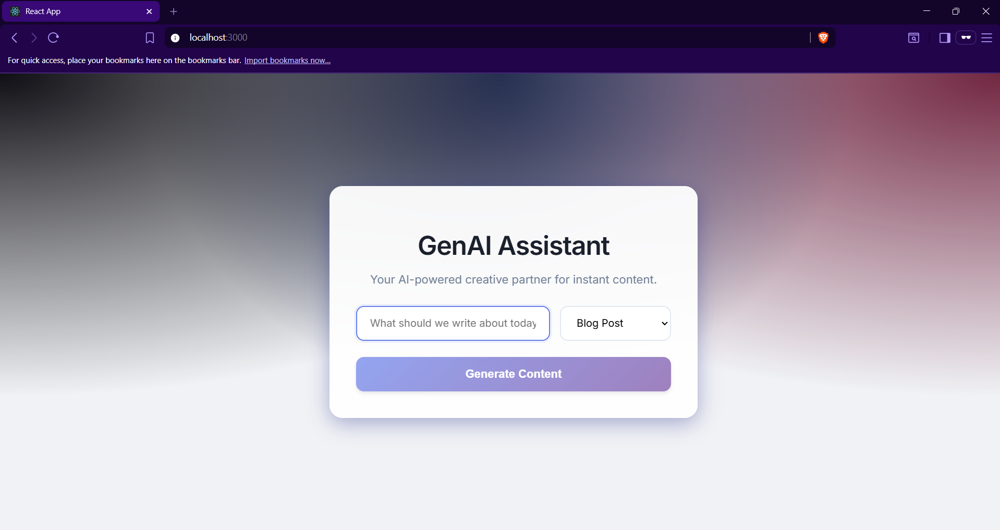

# GenAI Content Assistant

### 🔴 [Live Demo Link](https://gen-ai-content-assistant.vercel.app/)

A full-stack AI-powered application that generates professional content (Blog posts, LinkedIn updates, Twitter threads) instantly. Built with the **MERN Stack** (MongoDB, Express, React, Node.js) and designed with a modern **Glassmorphism UI**.



## 🚀 Features
- **AI-Powered Generation:** Generates context-aware content using Generative AI logic.
- **Modern UI:** Responsive "Glassmorphism" design using CSS3 variables and animations.
- **Full Stack Architecture:** RESTful API backend (Node/Express) connected to a React frontend.
- **Real-time Feedback:** Asynchronous state management with loading indicators.

## 🛠️ Tech Stack
- **Frontend:** React.js, CSS3 (Glassmorphism), Axios
- **Backend:** Node.js, Express.js
- **AI Integration:** OpenAI API (Architecture ready)

## ⚙️ How to Run Locally

### 1. Clone the Repo
```bash
git clone [https://github.com/Teja-101/GenAI-Content-Assistant.git](https://github.com/Teja-101/GenAI-Content-Assistant.git)
cd GenAI-Content-Assistant

### 2. Setup Backend
```bash

cd genai-backend
npm install
node server.js
The server will start on port 5000.

### 3. Setup Frontend
Open a new terminal:
```bash

cd genai-frontend
npm install
npm start
The app will open at http://localhost:3000.

Future Improvements
[ ] Integration with GPT-4 real-time API.

[ ] User Authentication (Login/Signup).

[ ] History tab to save generated content.

Developed by Kasimsetti Teja Narasimha.